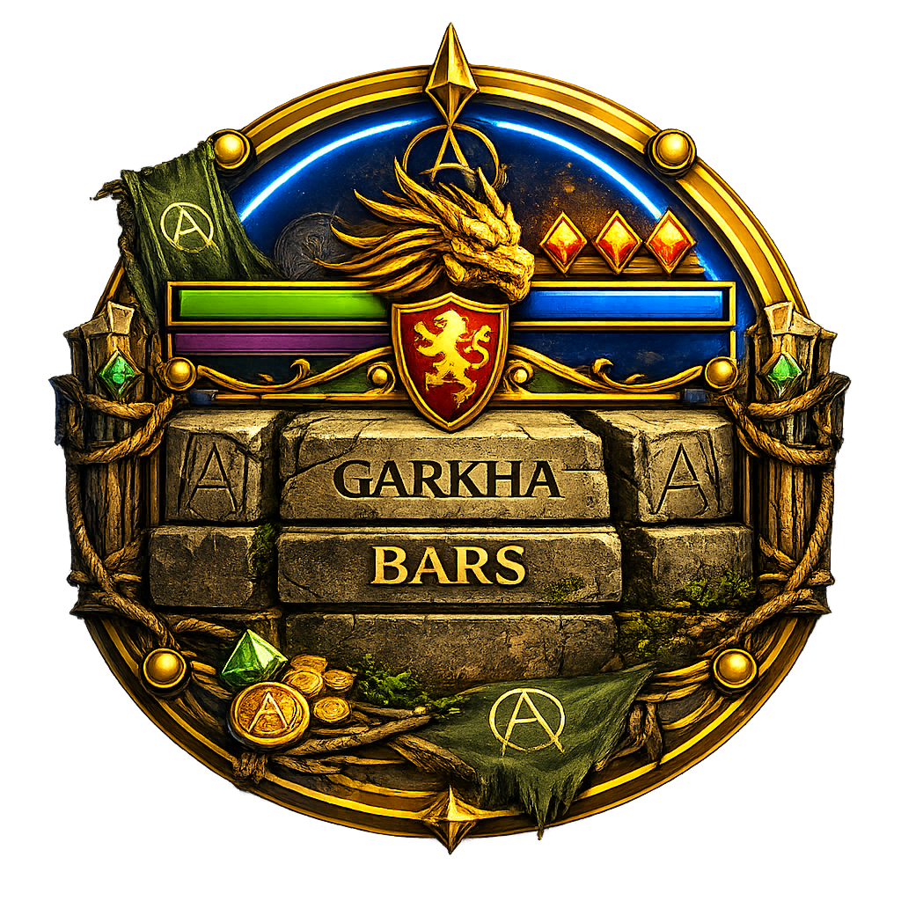

# Gharka Bars

Because stock nameplates are fine right up until the raid starts moving.

`Gharka Bars` keeps the important information where you can actually use it:

- replaces stock overhead clutter with cleaner HP and MP bars
- supports `player`, `target`, `watchtarget`, `mount/pet`, and raid members
- shows role icons, distance text, target highlighting, and CC timers
- includes a movable launcher icon and in-game settings window
- supports layout presets, named profiles, and local backups

## Install

1. Install via Addon Manager.
2. Make sure the addon is enabled in game.
3. Click the launcher icon to open or close settings.

Saved data lives in `gharka-bars/.data` so settings, profiles, backups, and launcher position survive updates.

## Quick Start

1. Click the launcher icon to open `Gharka Bars`.
2. Use `General`, `Layout`, `Text`, `CC`, and `Colors` to tune the bars.
3. Pick a preset if you want a quick baseline before fine-tuning.
4. Save a named profile or backup once the layout feels right.

This is basically the addon version of telling stock nameplates to stop making raid healing harder than it needs to be.

## How To

### Bars

The bars are built to stay useful when fights get crowded.

You can use them for:

- fast `player`, `target`, and `watchtarget` tracking
- `mount/pet` visibility when enabled
- raid member HP and MP visibility
- CC icon and timer awareness
- role and distance scanning
- target highlighting without relying on stock clutter

### Settings

The settings window is where you tune how the bars behave and look.

You can:

- adjust layout, spacing, text, colors, and CC display
- swap between presets like `Raid`, `Compact`, `Large`, and `Minimal`
- save and load named profiles from `.data`
- create backups before larger changes
- optionally test `Cluster mode (exp)` if you want overlap handling

### Click Targeting

The HP bar is the click surface for targeting.

You can:

- click bars to target units
- hold `Shift` or `Ctrl` to make the bars click-through
- move the launcher and settings window with `Shift + drag`

## Notes

- The addon stores settings under `.data/settings.txt` and keeps named profiles in `.data`.
- Launcher position is stored separately so it does not get stomped by profile changes.
- Backup files are stored in `.data/backups`.
- The launcher icon has its own saved position file so profile swaps do not reset it.
- Holding `Shift` or `Ctrl` makes bars click-through for easier camera control in crowded fights.
- `watchtarget` and other client-dependent surfaces still rely on what AAClassic exposes at runtime.

1.5.47
